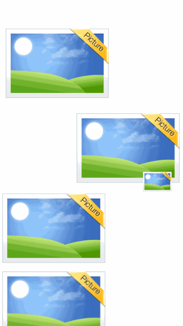
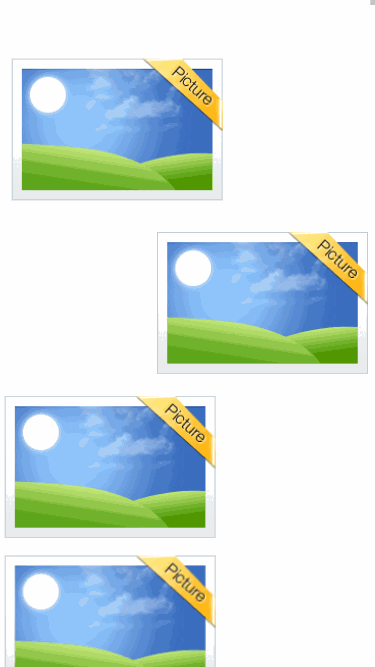

## 设置ID

右键进入源代码，找到第二行的 `div`

    

在这个`div`后写入`id="BackTop"`  

> 注意前后都需要有空格, 不能连在一块

修改后源代码如下

    

## 固定图片

在返回顶部组件中找到`position: absolute`  
一般在`width`后方, 在`left`前方

    

将`position: absolute`更改为`position: fixed`即可

修改后源代码如下

    

## 添加链接

在返回顶部组件中找到`img`开头的行

    

在前方添加`<a href="#BackTop">`, 后方添加`</a>`  
修改后源代码如下

    </a>

> 还有一个方法, 右键图片 > 链接 > 外部链接 > 填入`#BackTop`  
这样也能实现返回顶部的链接  

效果预览  

---

## 返回顶部默认隐藏

> 注意看任务书, 部分题目可能不需要这一步

- 添加js代码

在`任务一/代码`内找到返回顶部的js后打开, 全部复制, 随后右键打开源代码, 点进`JavaScript`, 粘贴到此处即可

- 修改图片组件

在返回顶部组件中找到`img`开头的行

    

在`img`后添加`id="returnTop"`  
在`width:100%;height:100%`字段后方添加`;display:none`, 注意要在**双引号**内  
修改后源代码如下

    

效果预览  
